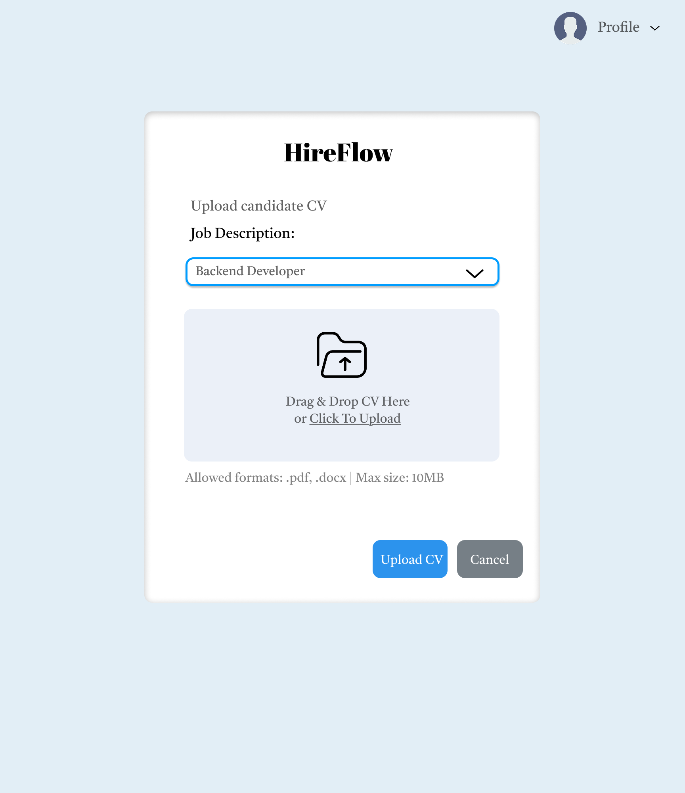
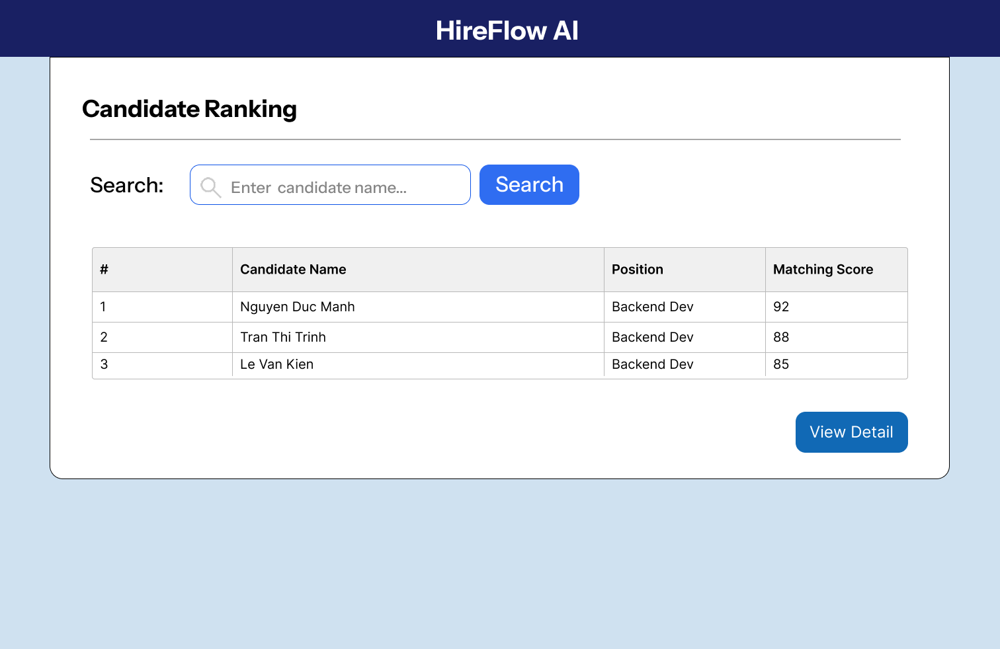

# HireFlow AI

> AI-powered Recruitment Screening & Candidate Management (BA Portfolio Project)

## Project Overview

HireFlow AI là dự án Business Analysis mô phỏng quy trình xây dựng một hệ thống hỗ trợ tuyển dụng tích hợp AI dành cho doanh nghiệp vừa và nhỏ.

Mục tiêu của dự án là giải quyết bài toán sàng lọc CV thủ công, quản lý ứng viên phân tán và khó theo dõi tiến trình tuyển dụng.

---

## Business Problem

- HR phải đọc và sàng lọc CV thủ công.
- CV đến từ nhiều nguồn khác nhau (Email, LinkedIn, nền tảng tuyển dụng).
- Khó theo dõi trạng thái ứng viên.
- Quy trình tuyển dụng thiếu tính nhất quán.

---

## MVP Features

### Included in MVP

- AI CV Screening
- Candidate Management
- Candidate Pipeline
- Search & Filter Candidate
- Job Description Management

### Out of Scope

- Recruitment Dashboard
- Candidate Portal
- Interview Scheduler
- Email Notification

---

## Deliverables

### Product Discovery
- Product Vision
- Business Problem Analysis
- Stakeholder Analysis
- User Persona
- Pain Point → Solution Mapping

### Requirement Analysis
- MVP Feature List
- Use Case Diagram
- Use Case Specification
- User Story
- Acceptance Criteria

### UI / UX
- Low Fidelity Wireframes
- Interactive Prototype

---

## Wireframes

### Upload CV Screen


### Candidate Ranking Screen


---

## Interactive Prototype

🔗 **Figma Prototype:** (Thêm link prototype sau khi tạo)

---

## Repository Structure

```text
HireFlow-AI-BA-Portfolio
├── docs/
│   ├── product-discovery/
│   └── requirement-analysis/
├── diagrams/
├── wireframes/
├── backlog/
├── research/
├── presentation/
└── assets/
```

---

## My Role

Business Analyst (Portfolio Project)

### Responsibilities
- Phân tích bài toán nghiệp vụ tuyển dụng.
- Xác định MVP và phạm vi dự án.
- Thiết kế Use Case, User Story và Acceptance Criteria.
- Xây dựng Wireframe và Prototype.
- Quản lý tài liệu nghiệp vụ trên GitHub.

---

## Status

✅ Sprint 1 – Requirement Analysis & Wireframe Completed

🚧 Next Phase: Interactive Prototype & Backlog Management
