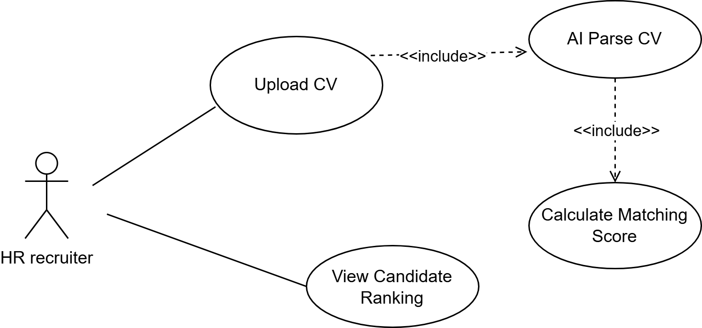

# Use Case Diagram – AI CV Screening

## Mục tiêu

Tài liệu này mô tả các tương tác giữa HR Recruiter và hệ thống HireFlow AI trong quá trình sử dụng tính năng AI CV Screening. Use Case Diagram giúp xác định các chức năng chính của hệ thống và phạm vi tương tác của người dùng.

---

## Actor

### Primary Actor

- HR Recruiter

---

## Use Cases

| ID | Use Case | Description |
|----|-----------|-------------|
| UC-01 | Upload CV | HR tải CV ứng viên lên hệ thống |
| UC-02 | AI Parse CV | Hệ thống phân tích và trích xuất thông tin từ CV |
| UC-03 | Calculate Matching Score | Hệ thống tính toán mức độ phù hợp giữa CV và Job Description |
| UC-04 | View Candidate Ranking | HR xem danh sách ứng viên được xếp hạng theo điểm phù hợp |

---

## Use Case Flow

```text
Upload CV
    ↓
AI Parse CV
    ↓
Calculate Matching Score
    ↓
View Candidate Ranking
```

---

## Diagram



---

## Notes

- Sau khi HR thực hiện Upload CV, hệ thống sẽ tự động kích hoạt quá trình phân tích CV.
- AI Parse CV và Calculate Matching Score là các xử lý nội bộ của hệ thống.
- HR Recruiter là actor duy nhất tương tác trực tiếp với tính năng AI CV Screening trong phiên bản MVP.
- Candidate không tham gia trực tiếp vào Use Case này.

---

## My Analysis

Use Case Diagram cho thấy toàn bộ quy trình AI CV Screening bắt đầu từ hành động Upload CV của HR Recruiter và kết thúc bằng việc xem danh sách ứng viên được xếp hạng theo mức độ phù hợp.

Trong quy trình này, các bước AI Parse CV và Calculate Matching Score đóng vai trò xử lý tự động của hệ thống nhằm giảm khối lượng công việc thủ công cho HR. Đây cũng là hai chức năng tạo ra Business Value lớn nhất của tính năng AI CV Screening vì chúng trực tiếp hỗ trợ việc rút ngắn thời gian sàng lọc hồ sơ và tăng khả năng tìm đúng ứng viên phù hợp.
